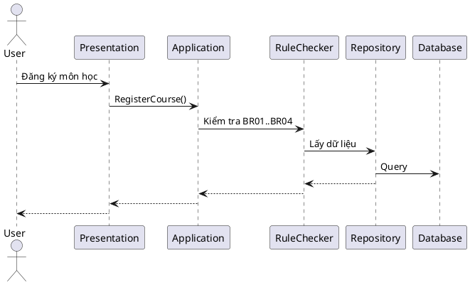

# 10. Technical Architecture

## Clean Architecture Overview
Dự án Student Registration System áp dụng mô hình **Clean Architecture** để đảm bảo code dễ bảo trì, mở rộng, test và tách biệt rõ ràng giữa các tầng.

### Các tầng chính:
- **Domain Layer**: Chứa business model, entity, interface, exception. Không phụ thuộc bất kỳ tầng nào khác.
- **Application Layer**: Chứa logic nghiệp vụ (service, rule checker), orchestrate flow, không truy cập trực tiếp DB, không phụ thuộc UI.
- **Infrastructure Layer**: Chứa code truy cập dữ liệu (repository, DB, file, API), implement interface từ Domain.
- **Presentation Layer**: UI, Console, Web API, chỉ gọi Application Layer, không chứa logic nghiệp vụ.

---

## Data Flow Example: RegisterCourse Use Case

1. **UI/Console** nhận yêu cầu đăng ký môn học
2. Gọi Application Service (RegisterCourseService)
3. Service gọi các RuleChecker (BR01, BR02, BR03, BR04...)
4. RuleChecker gọi Repository (qua interface) để lấy dữ liệu
5. Repository (ở Infrastructure) truy vấn DB/InMemory
6. Nếu pass hết rule → Service thao tác lưu dữ liệu
7. Trả kết quả về UI

---

## Sơ đồ luồng xử lý (PlantUML)

---

## Nguyên tắc Clean Architecture
- Domain không gọi trực tiếp DB, không phụ thuộc Infrastructure
- Logic nghiệp vụ nằm ở Application, không nằm ở UI/Presentation
- Tầng dưới không phụ thuộc tầng trên (Infrastructure không biết Application)
- Tất cả rule đều test được độc lập
- Dễ dàng thay thế Infrastructure (InMemory, SQLite, API...)

---

## Tham khảo thêm
- [docs/01_Business_Requirement.md](01_Business_Requirement.md)
- [docs/05_Business_Rules.md](05_Business_Rules.md)
- [docs/12_Rule_Validation_Framework.md](12_Rule_Validation_Framework.md) 