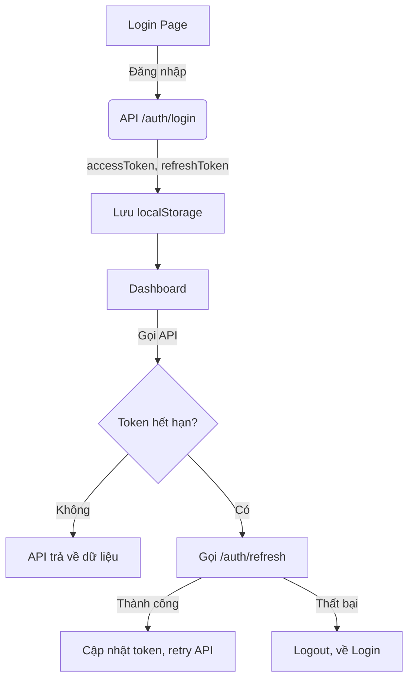

# 02. Auth Flow (Luồng xác thực)

## Tổng quan
- Sử dụng JWT + Refresh Token
- Lưu token ở localStorage
- Tự động refresh khi access token hết hạn
- Logout xóa token, redirect về login

## Luồng đăng nhập
1. User nhập username/password ở trang `/login`
2. Gọi API `POST /auth/login` → nhận `accessToken`, `refreshToken`, `expiresIn`
3. Lưu token vào localStorage
4. Chuyển hướng sang `/dashboard`

## Luồng gọi API
- Mọi request qua Axios sẽ tự động attach accessToken vào header
- Nếu accessToken hết hạn (401), Axios tự động gọi `/auth/refresh` với refreshToken
- Nếu refresh thành công → update accessToken, retry request
- Nếu refresh thất bại → logout, redirect login

## Luồng logout
- Gọi API `/auth/logout` (nếu có)
- Xóa token khỏi localStorage
- Redirect về `/login`

## Sơ đồ luồng (mermaid)


## Ví dụ code
```ts
// Đăng nhập
await authAPI.login({ username, password });
// Logout
await authAPI.logout();
```

## Checklist
- [x] Hiểu rõ flow login, refresh, logout
- [x] Biết debug khi token hết hạn
- [x] Biết cách lưu/xóa token 